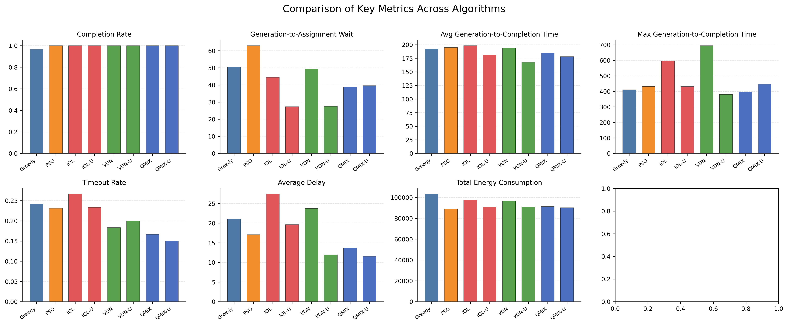
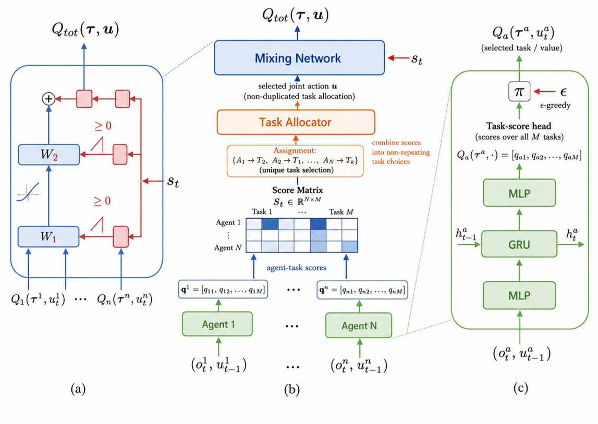
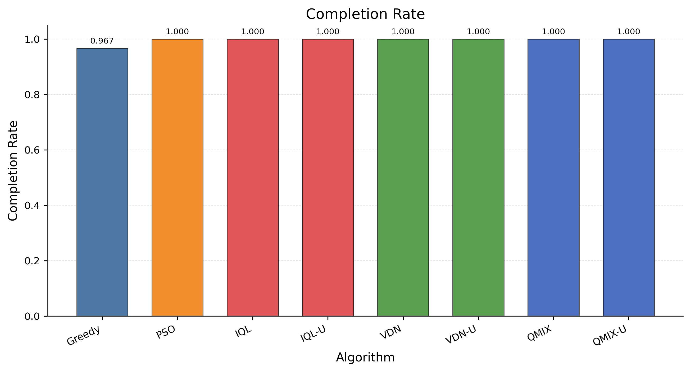
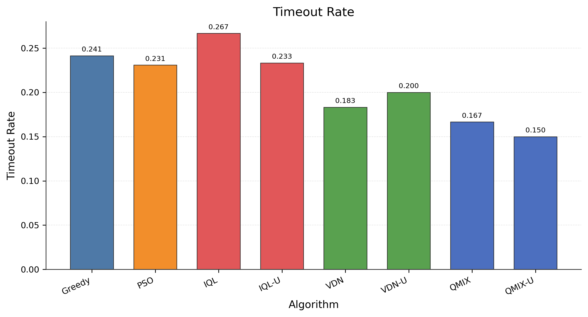
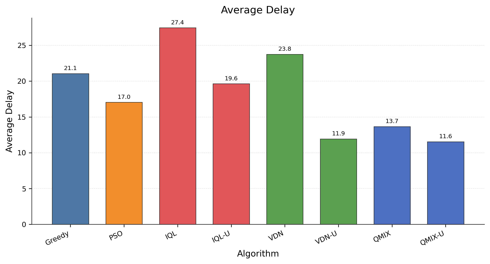
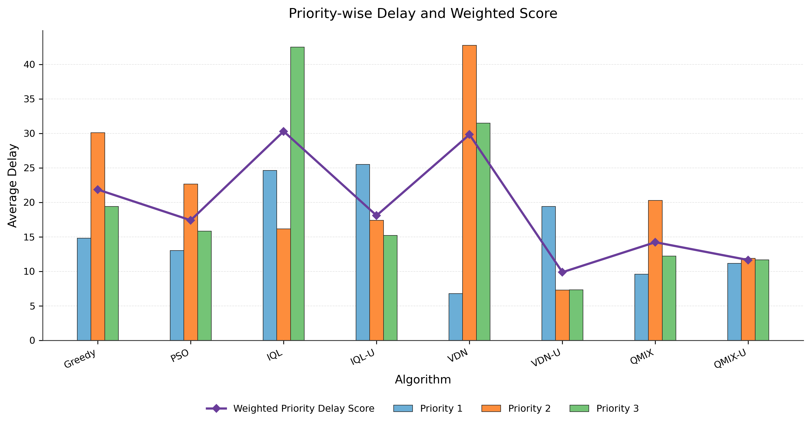
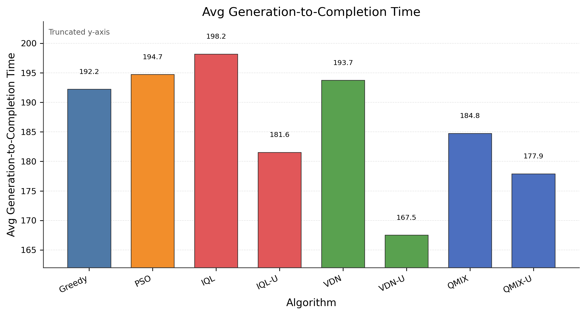
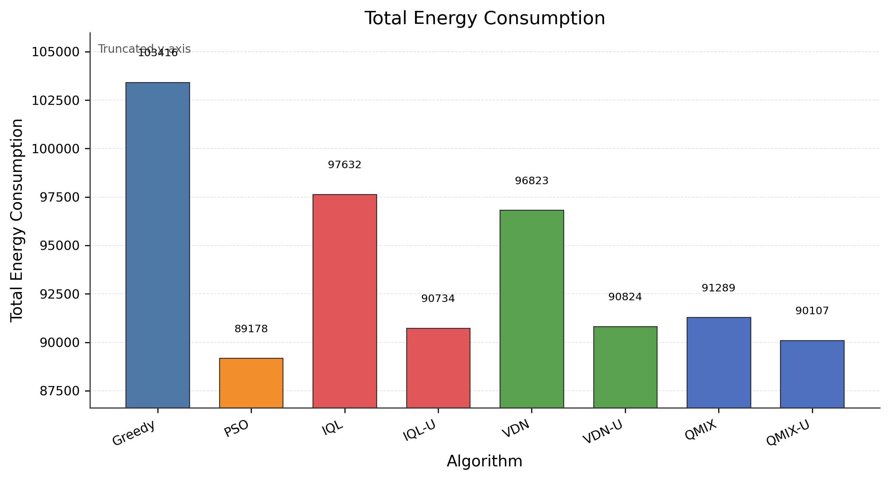
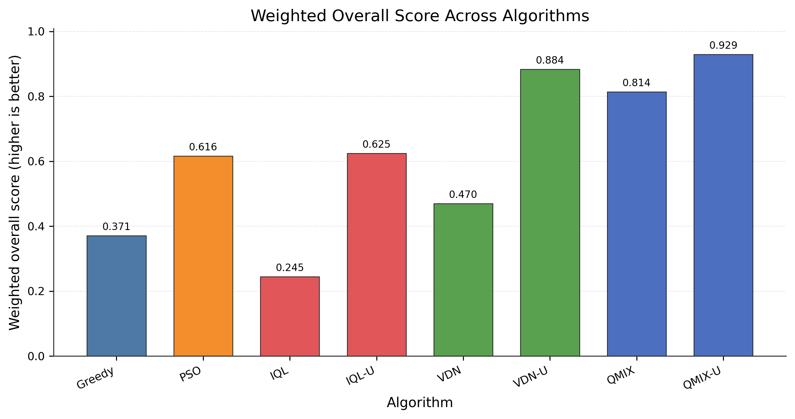

# 低空无人机物流协同任务调度平台论文中文版

## 摘要

低空物流配送需要在多无人机、多订单、动态到达的环境中完成协同任务调度，同时受到载重、电量、充电站、订单时限、任务优先级和城市禁飞区等约束。本文完成了一个低空无人机物流协同任务调度平台，并在统一仿真环境中比较贪心算法、粒子群优化算法（PSO）以及 IQL、VDN、QMIX 三种多智能体强化学习算法。平台支持真实化订单生成、热点区域聚集、潮汐式订单高峰、载重-能耗耦合、多任务携带、绕飞障碍物、自动充电和实时可视化。针对 MARL 中多个无人机可能选择同一订单的问题，本文进一步实现独立任务分配器，并测试 IQL-U、VDN-U、QMIX-U 三个变体。实验结果表明，贪心算法响应快但容易出现局部最优和任务饥饿；PSO 在能耗和完成率上表现稳定；加入独立任务分配器后的 MARL 算法显著降低冲突、超时率和平均延迟，其中 QMIX-U 在综合加权指标上取得最佳效果。

## 1. 引言

低空无人机物流调度可以看作一个典型的多智能体协同决策问题。系统中有多架无人机和不断生成的配送订单，每架无人机都需要根据当前位置、电池电量、载重状态、订单起终点、订单剩余时间和优先级进行任务选择。调度器不仅要提高任务完成率，还要降低生成到分配等待时间、配送完成时间、超时率、平均延迟和总能耗。

该问题的难点在于多个目标互相耦合。距离最近的订单不一定最紧急，高优先级订单不一定离无人机最近，能耗最低的路线也不一定能满足截止时间。同时，多个无人机可能同时选择同一个订单，导致无效动作和资源浪费。因此，本文围绕“统一平台 + 多类算法 + 统一指标评估”的思路，对低空物流任务调度进行建模、实现和实验分析。

本文主要工作包括：

1. 构建低空无人机物流协同任务调度平台，支持真实化订单生成、无人机运动、电量消耗、充电站、禁飞区绕行和可视化。
2. 实现贪心、PSO、IQL、VDN、QMIX 五类调度策略，并在同一环境下输出统一指标。
3. 针对 MARL 任务冲突问题，实现独立任务分配器，得到 IQL-U、VDN-U、QMIX-U 三个改进版本。
4. 从完成率、超时率、平均延迟、优先级延迟、完成时间、能耗和综合指标等角度进行对比分析。

## 2. 背景、近期研究动态与调研

参考论文 `p464.pdf` 是 AAMAS 2017 的多智能体强化学习论文。它的内容并不是无人机物流，但结构很完整：先给出研究背景和问题动机，再给出定义与符号、学习算法、仿真方法、实验结果和讨论。本文借鉴这种组织方式，在平台论文中补充背景调研、数学模型、算法伪代码、实验图表和结果分析。

### 2.1 研究背景

低空无人机配送属于最后一公里物流和多 UAV 任务分配的交叉问题。与传统车辆路径规划相比，无人机配送还受到电池容量、载重、充电站、禁飞区、飞行安全和实时订单变化的影响。因此，它不是简单的“最短路径”问题，而是一个动态、多约束、多目标的协同决策问题。

在实际系统中，调度算法不能只输出一条理论最优路径，还需要和订单生成、无人机执行、能耗统计、充电逻辑、任务超时判断和可视化界面连接起来。因此，本文更强调平台化实现：在统一仿真环境中比较贪心、PSO 和 MARL，而不是只单独讨论某一个算法。

### 2.2 近期研究逐篇调研

Shuaibu 等人在 2025 年发表的 last-mile delivery optimization 综述，系统总结了最后一公里配送优化中的路线规划、实时监控、无人机集成和可持续性问题。该文的价值在于指出物流系统评价不能只看距离，还要看时效、成本、能耗和服务质量。这与本文的综合指标设计一致：本文同时统计完成率、超时率、平均延迟、完成时间和能耗，并用加权分数衡量整体性能。不同之处在于，该文是宏观综述，而本文实现了一个具体的无人机物流调度平台。

Alqefari 和 Menai 在 2025 年发表的多 UAV 动态任务分配综述，对 2013-2024 年动态环境下的多无人机任务分配方法进行了分类，包括市场机制、优化方法、聚类方法等。该文强调动态任务分配具有 NP-hard 特征，实时系统往往需要在最优性和响应速度之间折中。本文的实验正体现了这种折中：贪心算法响应快但容易局部最优，PSO 可以批量优化但需要触发和计算时间，MARL 可以学习动态状态下的策略但需要训练。

Li 等人在 2024 年关于异构 UAV 协同任务分配的综述中，讨论了 UAV 能力差异、任务模型、协同机制和人工智能方法。虽然本文当前实验使用的是同构无人机，但其调研结论仍然有参考价值：真实任务分配必须考虑能力约束、任务属性和协同关系。因此，本文在平台中加入了载重、电量、优先级、路径距离、充电站和禁飞区等约束，而不是只做理想化的订单匹配。

He 等人在 2024 年研究了考虑动态优先级变化的多 UAV 任务分配算法，提出遗传算法与贪心策略结合的改进方法。该文强调任务优先级并不一定固定，在应急场景中任务紧急程度会随时间变化。本文当前设置中，订单优先级在生成后保持不变，但已经在奖励函数和延迟惩罚中体现优先级权重。后续可以借鉴该文，将任务优先级改为动态变化，从而测试调度器的在线重分配能力。

Kong 等人在 2023 年提出了基于深度强化学习的多 UAV 目标分配与路径规划方法，将问题建模为 POMDP，并在动态多障碍物环境中联合处理目标分配和路径规划。该文的启发是：任务分配和路径规划并不是完全独立的，路径可行性和障碍物会反过来影响任务选择。本文当前采用“高层分配 + 环境执行路径”的架构，已经记录了路径和能耗带来的指标差异，但还没有把路径规划纳入学习策略本身。后续可以进一步做联合训练。

Qie 等人在 2019 年提出基于 MARL 的多 UAV 目标分配与路径规划联合优化方法。该文较早说明了 UAV 调度为什么适合用多智能体强化学习：每架无人机的动作会影响全局目标，并且多个 UAV 之间存在任务冲突和协作关系。本文的 IQL、VDN、QMIX 对比也基于类似动机，但本文场景更偏物流配送，额外加入了订单截止时间、任务优先级、载重、能耗和充电逻辑。

Guven 和 Parlak 在 2026 年研究了基于 MARL 的无人机动态医疗物资配送。该场景和本文非常接近，因为医疗物资配送同样具有时间紧迫性、动态请求和多无人机协同。该文采用 PPO 系列方法，而本文采用 IQL、VDN、QMIX 等价值分解方法，并额外与贪心和 PSO 做对比。二者共同说明：动态配送任务需要将任务优先级、请求位置、无人机状态和时间约束统一建模。

Xing 等人在 2025 年关于 UAV 控制中 MARL 的综述中，总结了集中训练分散执行、价值分解、通信机制和真实 UAV 控制中的复杂性问题。该文与本文的关系在于，VDN 和 QMIX 正是典型的价值分解方法，适合多无人机分散执行。该综述也提醒我们：更复杂的 MARL 方法不一定适合所有工程场景，因此本文保留贪心和 PSO 作为简单、可解释、低成本的基线。

Wang 等人在 2025 年讨论了 UAV 与 LLM 结合的 agentic low-altitude mobility。该方向比传统优化和 MARL 更前沿，强调未来低空系统可能结合语言理解、任务规划、工具调用和多模态感知。对本文的启发是，平台模块化很重要：只要环境、指标和调度接口清晰，未来可以继续接入更复杂的智能体，而不需要重写底层仿真系统。

### 2.3 调研总结

综合上述研究可以看出，多 UAV 任务分配正在从静态、单目标、离线优化，转向动态、多目标、在线学习和平台化验证。现有研究往往专注于某一种算法，或者停留在综述层面。本文作为课程项目，重点补足“可运行平台 + 多算法统一比较”这一环节：在同一订单生成器、无人机模型、能耗模型和指标统计框架下，对贪心、PSO、IQL、VDN、QMIX 以及带独立任务分配器的 MARL 变体进行比较。

## 3. 平台与问题建模

### 3.1 系统场景

平台模拟城市低空物流配送任务。系统中包含无人机、动态订单、仓库、充电站、地图障碍物和可视化界面。订单由起点、终点、生成时间、截止时间、优先级和重量组成；无人机包含位置、电量、载重、任务队列和航线等状态。

实验配置中，无人机数量为 10 架，充电站数量为 10 个，任务生成总数为 60 个。订单生成采用 realistic 模式，不再是简单均匀随机生成，而是加入时间和空间两方面的真实特征：

- 时间维度：存在高峰和低谷，订单生成间隔随周期变化，并带有随机波动。
- 空间维度：订单会向热点区域聚集，用于模拟商圈、写字楼或居民区等高频产单区域。

### 3.2 无人机与任务约束

无人机模型考虑载重与能耗耦合。载重越大，单位距离能耗越高。无人机还受到最大载重、电池容量和低电量回充电站等约束。平台支持一机多单，即当无人机剩余载重允许时，可以同时携带多个订单。

路径规划采用直线飞行与禁飞区绕行相结合的方式。遇到高层建筑或禁飞区域时，无人机需要绕行，而不是直接穿过障碍物。因此，调度决策不仅影响任务分配，也会影响实际完成时间和能耗。

### 3.3 数学模型

设无人机集合为：

```text
D = {1, 2, ..., N}
```

时刻 `t` 的未分配任务集合为 `T_t`。每个任务 `j` 包含起点 `s_j`、终点 `g_j`、重量 `w_j`、截止时间 `d_j`、生成时间 `tau_j` 和优先级 `p_j`。任务分配变量定义为：

```math
x_{ij}^{t} \in \{0,1\}
```

其中 `x_{ij}^{t}=1` 表示无人机 `i` 在时刻 `t` 接受任务 `j`。每一步的可行分配需要满足：

```math
\sum_i x_{ij}^{t} \le 1,\quad \sum_j x_{ij}^{t} \le 1
```

第一项表示一个订单不能被多架无人机重复接取；第二项表示每架无人机在一个高层决策步最多新增一个任务。

载重相关能耗模型为：

```math
E_i(l,q_i)=l \cdot b \left(1+\frac{q_i}{Q_i}\eta\right)
```

其中 `l` 是飞行距离，`q_i` 是当前载重，`Q_i` 是最大载重，`b` 是基础能耗系数，`eta` 是载重惩罚系数。任务延迟定义为：

```math
\Delta_j=\max(0,c_j-d_j)
```

其中 `c_j` 是任务完成时间。

### 3.4 观察空间与动作空间

平台为高层调度器提供统一观察空间。观察内容包括无人机当前位置、是否空闲、电量比例、载重比例、未分配订单列表、订单剩余时间、优先级、重量、路径距离和可接单掩码。

在 PyMARL 环境封装中，每个无人机是一个 agent。每个 agent 的动作是选择一个可见任务槽位，或者选择 NoOperation。实验中可见任务槽数量为 8，因此每个 agent 可以从 8 个任务槽和 1 个空操作中选择。





## 4. 调度算法设计

### 4.1 贪心算法

贪心算法是最简单的基线策略。每一步中，它筛选空闲无人机和未分配订单，然后根据无人机当前位置到订单起点的欧氏距离进行选择，优先把较近的订单分配给可用无人机。

```text
Algorithm 1 Greedy Task Assignment
Input: observation O_t
Output: assignments A_t
1: A_t <- empty
2: filter idle drones and valid unassigned tasks
3: for each idle drone i do
4:     build feasible candidate task list
5:     choose nearest task by source distance
6:     A_t[i] <- selected task id
7:     remove selected task from candidate pool
8: return A_t
```

贪心算法优点是响应速度快、实现简单、行为稳定，不需要训练或迭代优化。缺点是只关注局部距离，缺少全局视野。在订单密集区域中，无人机可能持续被附近订单吸引，导致远处或紧急订单长期得不到服务。

### 4.2 PSO 算法

PSO 将任务分配问题转化为多目标优化问题。粒子使用连续偏好矩阵表示无人机对任务的分配倾向，再通过适应度函数评估分配方案。当前适应度由准时率、平均延迟和能耗组成：

```math
F=0.4R_{on}+0.4\exp(-\bar{\Delta}/1000)+0.2(1-\bar{E}/B)
```

其中 `R_on` 是准时率，`\bar{\Delta}` 是平均延迟，`\bar{E}` 是平均每机能耗，`B` 是电池容量参考值。

```text
Algorithm 2 PSO Batch Scheduler
Input: buffered tasks T, idle drones D
Output: assignments A
1: initialize particle preference matrices
2: seed one particle with greedy assignment
3: for iteration = 1 ... K do
4:     decode each particle by argmax over drones
5:     simulate delivery order and charging
6:     compute fitness from on-time rate, delay, energy
7:     update personal best and global best
8:     update velocity and position
9: return decoded global-best assignment
```

PSO 模块采用双通道架构。简单订单可以通过直通通道快速响应；当任务在缓冲区积累，或者出现紧急任务时，触发 PSO 批量分配。这样可以让 PSO 重点处理多个任务竞争有限无人机的复杂场景。

### 4.3 MARL 算法

本文测试三种多智能体强化学习算法：

- IQL：每个 agent 独立学习动作价值函数，不使用混合网络。
- VDN：将各 agent 的局部价值函数求和，得到联合动作价值。
- QMIX：使用带全局状态条件的单调混合网络，在集中训练、分散执行框架下学习联合价值函数。

奖励由前端环境奖励和 PyMARL 包装层奖励共同构成，可概括为：

```math
r_t = r_t^{env} + \alpha_c\Delta C_t-\alpha_bB_t-\alpha_vV_t-\alpha_oO_t-\alpha_iI_t+r_t^{term}
```

其中 `Delta C_t` 是新增完成任务数，`B_t` 是积压任务代价，`V_t` 是无效动作数量，`O_t` 是超时任务代价，`I_t` 是空闲动作数量，`r_t^{term}` 是终局完成率和未完成任务相关奖励/惩罚。

### 4.4 独立任务分配器

原始 MARL 动作空间存在一个关键问题：多个无人机可能同时选择同一个任务。由于一个订单只能由一架无人机完成，重复选择会产生无效动作，并增加训练噪声。本文加入独立任务分配器，并将改进后的算法记为 IQL-U、VDN-U、QMIX-U。

```text
Algorithm 3 Unique Task Action Selection
Input: agent Q-values, action masks
Output: conflict-free actions
1: mask unavailable actions
2: collect all feasible (agent, task, Q) triples
3: sort triples by Q in descending order
4: for each triple (i, a, Q) do
5:     if agent i and task a are both unused then
6:         assign action a to agent i
7:         mark i and a as used
8: assign NoOperation to unselected agents
9: return selected actions
```

该机制使 MARL 输出更接近可执行的一对一任务匹配，减少冲突造成的无效动作。

## 5. 实验设置

主要实验配置如下：

| 配置项 | 数值 |
| --- | ---: |
| 最大仿真步数 | 2000 |
| 无人机数量 | 10 |
| 订单数量 | 60 |
| 可观察任务槽 | 8 |
| 充电站数量 | 10 |
| 任务优先级 | 1-3 |
| 任务重量 | 1-4 |
| 截止时间偏移 | 200-300 步 |
| 无人机最大载重 | 5 个重量单位 |
| 电池容量 | 15000 Wh |

评价指标包括完成率、超时率、平均延迟、按优先级统计的平均延迟、生成到分配等待时间、分配到装载等待时间、装载到送达时间、生成到完成平均时间、生成到完成最大时间、总能耗和综合加权指标。

综合加权指标越高越好：

```math
S = 0.18C + 0.22(1-T) + 0.15(1-D) + 0.15(1-D_p) + 0.14(1-G) + 0.16(1-E)
```

其中 `C` 为完成率，`T` 为超时率，`D` 为归一化平均延迟，`D_p` 为优先级加权延迟，`G` 为归一化平均完成时间，`E` 为归一化能耗。

## 6. 实验结果与分析

### 6.1 总体结果

| 算法 | 完成率 | 超时率 | 平均延迟 | 平均完成时间 | 最大完成时间 | 总能耗 | 综合分数 |
| --- | ---: | ---: | ---: | ---: | ---: | ---: | ---: |
| Greedy | 0.967 | 0.241 | 21.07 | 192.22 | 411.0 | 103415.8 | 0.371 |
| PSO | 1.000 | 0.231 | 17.05 | 194.72 | 432.1 | 89177.6 | 0.616 |
| IQL | 1.000 | 0.267 | 27.45 | 198.18 | 596.0 | 97632.2 | 0.245 |
| IQL-U | 1.000 | 0.233 | 19.63 | 181.55 | 431.0 | 90733.8 | 0.625 |
| VDN | 1.000 | 0.183 | 23.75 | 193.73 | 695.0 | 96823.4 | 0.470 |
| VDN-U | 1.000 | 0.200 | 11.93 | 167.52 | 380.0 | 90823.9 | 0.884 |
| QMIX | 1.000 | 0.167 | 13.67 | 184.75 | 396.0 | 91288.6 | 0.814 |
| QMIX-U | 1.000 | 0.150 | 11.55 | 177.92 | 446.0 | 90107.1 | 0.929 |

从完成率看，除 Greedy 完成 58/60 个任务外，其余算法均完成全部 60 个任务。从综合分数看，QMIX-U 最优，VDN-U 次之，QMIX 排名第三。





### 6.2 独立任务分配器的作用

独立任务分配器对 MARL 算法整体有明显提升：

- IQL-U 相比 IQL，将平均延迟从 27.45 降至 19.63，综合分数从 0.245 提升到 0.625。
- VDN-U 相比 VDN，将平均延迟从 23.75 降至 11.93，将平均完成时间从 193.73 降至 167.52，综合分数从 0.470 提升到 0.884。
- QMIX-U 相比 QMIX，将超时率从 0.167 降至 0.150，将平均延迟从 13.67 降至 11.55，综合分数从 0.814 提升到 0.929。





### 6.3 贪心与 PSO 对比

贪心算法响应最快，但只完成 58 个任务，并且总能耗最高。原因是贪心主要关注当前距离，缺少对全局任务分布、任务紧急程度和未来负载的考虑。

PSO 完成全部任务，并且总能耗最低，说明批量优化和多目标适应度函数可以有效改善全局分配质量。PSO 的不足是需要等待缓冲区或紧急触发，在复杂动态场景中对实时状态的适应能力不如表现最好的 MARL 变体。





### 6.4 最优算法分析

QMIX-U 取得最高综合分数，主要原因是它同时具备以下优势：

- 完成率为 1.0；
- 超时率最低，为 0.150；
- 平均延迟最低，为 11.55；
- 能耗低于原始 QMIX 和多数非优化 MARL 算法；
- 独立任务分配器减少了多无人机抢同一订单造成的冲突。



因此，QMIX-U 在当前实验中最适合用于低空无人机物流协同任务调度。

## 7. 结论

本文完成了低空无人机物流协同任务调度平台，并在统一环境中比较了贪心、PSO、IQL、VDN、QMIX 以及三种带独立任务分配器的 MARL 变体。实验表明，贪心算法简单快速但容易陷入局部最优；PSO 是稳定有效的群体智能基线；MARL 在加入独立任务分配器后能显著减少任务冲突并提升综合性能。其中，QMIX-U 在综合指标上表现最好。

后续工作可以从以下方向继续扩展：

1. 增加不同订单密度、不同无人机数量和不同充电站容量下的泛化实验。
2. 引入随机天气、飞行速度扰动和更复杂的城市低空交通约束。
3. 将综合指标权重改为可配置或根据场景自动调整。
4. 进一步优化 MARL 的训练稳定性和在线重调度能力。
